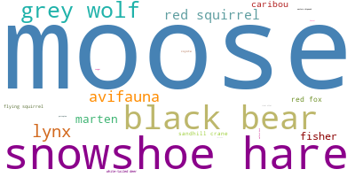
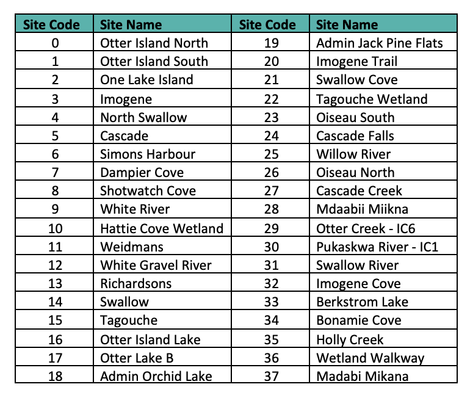
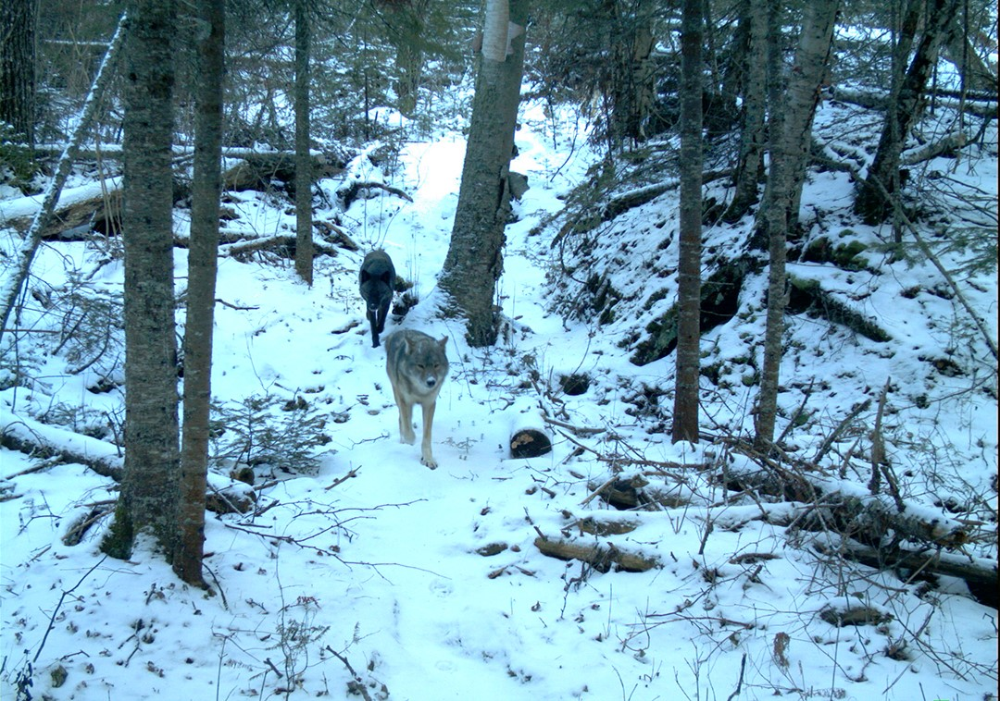

“Each species of animal has an important role in maintaining the Earth’s health and humanity’s ability to thrive.” So how do humans gather valuable information about wildlife? They set up camera traps! These devices capture compelling images that provide essential information about animal behavior, health, and movement.

Camera traps are essential for tracking endangered animals and combating poaching, helping to ensure the survival of vulnerable species. They are also used to confirm the existence of elusive and rare creatures, assess animal health, and observe when animals are most active.

They also help mitigate animal-vehicle collisions by monitoring frequent animal crossings on highways. With this data, governments can create wildlife crossings in high-traffic areas, ensuring both animals and drivers remain safe.

Lastly, camera traps are used to ensure wildlife can pass safely through man-made barriers such as fences. By monitoring these crossings, wildlife conservationists can identify and address potential dangers, such as barbed wire, and design more animal-friendly fences that allow wildlife to pass unharmed while keeping livestock in.

From 2010 to 2023, Pukaskwa National Park captured 2,126 images of moose, making them the most commonly observed species. Following moose are snowshoe hares, with 1,734 sightings. Beavers, Eastern chipmunks, and Mallard ducks were among the least commonly observed species, each with only 2 sightings.

  

Let’s break it down and take a look at the line plot below, which shows the number of species observed each year. At first glance, the graph may seem cluttered and hard to read. But don’t worry—it’s **interactive!** Simply click on the legend to display the species you’re interested in analyzing. By exploring different combinations, you can make various observations. For example, the snowshoe hare had the highest number of sightings in 2020. Commonly observed species each year include black bears, grey wolves, lynx, moose, and snowshoe hares. What observations can you make?



In 2010, Otter Island recorded a total of 52 moose sightings. Over the years, there has been a steady decline, with no moose observations on the island since 2021. The highest number of species spotted in a single location in one year occurred at One Lake Island in 2020, with 181 snowshoe hare observations. Raccoons were observed at Shotwatch Cove in both 2018 and 2021. While other species are spotted across various locations, it’s possible that Shotwatch Cove offers the ideal environment for raccoons, making it an especially suitable habitat for them. Which species will you analyze first?



The bar graph below compares the number of adult males and females identified by species each year. Upon analysis, it is apparent that determining the sex of a species from images alone is challenging. However, species such as caribou and moose are more easily distinguishable. Overall, the difference in numbers between male and female caribou and moose is relatively small.



As mentioned earlier, scientists use camera traps to study species behaviors, analyzing data like this to determine whether a species is nocturnal or diurnal. The bar graph below shows the number of species observed during the day and night. This visualization was created by using the average sunrise and sunset times for each season. The season and time each species was detected were then processed through a function to determine whether the animal was spotted during daylight hours or after dark.

Species such as avifauna, black bears, caribou, fisher, grey wolves, moose, and red squirrels are more commonly observed during the day. In contrast, lynx and snowshoe hares are primarily seen at night. While there isn’t enough data to definitively classify these species as nocturnal or diurnal, we can still gain valuable insights into their behaviors—leaving the final conclusions to the scientists.



# What will you see?

Welcome to the Wildlife Species Prediction app for Pukaskwa National Park!

Thinking about taking a trip to Pukaskawa National Park now that you’ve learned so much about it?

Click the link below to interact with the model:

[Go to Streamlit App](https://wildlife-in-pukaskwa-national-park-kxvbjapttj6u42f372cusb.streamlit.app/)





## Data Collection and Cleaning

The dataset used for this data story was sourced from the Government of Canada's open portal website (referenced below). It consists of 6,120 rows and 20 columns, containing data collected from 2010 to 2023. The information is gathered from a camera set up in Pukaskwa National Park to capture wildlife photos. The data contains the camera location, including the site name, easting, and northing coordinates. It identifies the species observed, along with the time, date, and season when each photo was taken. Additionally, the dataset provides information on the sex and relative age of the species (adult, youth, cub/calf).

The dataset was cleaned by removing unnecessary rows and columns, converting columns to the appropriate data types, and transforming the Easting and Northing values into Longitude and Latitude. Column names were renamed for clarity, and species and site names were standardized. Additionally, all NaN values and rows with unknown species were removed, as they do not contribute to the story.

Dampier Cove November 20, 2019

# References

Candid cameras. National Parks Conservation Association. (n.d.). https://www.npca.org/articles/2282-candid-cameras#:~:text=While%20camera%20traps%20can%20be,benefits%20of%20this%20powerful%20tool. 

Forbes, C. (2022, June 23). 4 reasons why animals are important to an ecosystem. Fahlo. https://myfahlo.com/en-ca/blogs/wildlife/four-ways-animals-help-protect-the-ecosystem#:~:text=Through%20their%20roles%20as%20pollinators,for%20food%20production%20and%20biodiversity.

Log into Facebook. Facebook. (n.d.). https://www.facebook.com/photo.php?fbid=2771506359566889&id=352949078089308&set=a.496974943686720 

Parks Canada Agency, G. of C. (2022, November 19). Wildlife crossing structures and research. Banff National Park. https://parks.canada.ca/pn-np/ab/banff/nature/conservation/transport/tch-rtc/passages-crossings 

Weatherspark.com. Pukaskwa Climate, Weather By Month, Average Temperature (Ontario, Canada) - Weather Spark. (n.d.). https://weatherspark.com/y/146583/Average-Weather-at-Pukaskwa-Ontario-Canada-Year-Round

Wolf - Pukaskwa - Wolf - Pukaskwa - survey data (Wildlife Camera). Open Government Portal. (n.d.). https://open.canada.ca/data/en/dataset/6c644bdd-aaa2-47c5-991a-f0c42b87bccf/resource/fe52e8cb-2760-4d42-b221-d02d55de57b7
